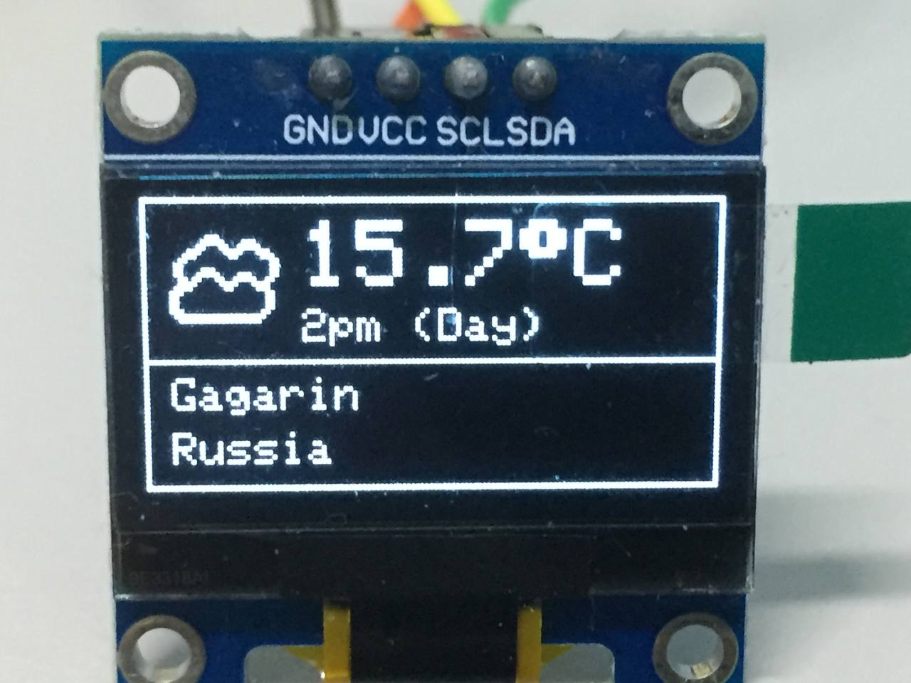

# Random Weather Generator

This is a random weather generator to display weather information of a random location using ESP-01S module (with ESP8266 chip) and SSD1306 OLED display at an interval of 30 seconds (maximum 10 seconds if edited).



- Weather condition (with symbol)
- Temperature
- Local time
- Whether there is daylight
- Location name
- Country name

## Usage

### 1. Install the libraries below in Arduino IDE. 

- Adafruit GFX Library (1.11.5)
- Adafruit SSD1306 (2.5.7)
- ArduinoJson (6.21.2)

### 2. Ensure I2C address and pin configuration is correct.

```cpp
#define SCREEN_ADDRESS 0x3C // See datasheet for Address (Try 0X3D if failure)
```

```cpp
Wire.begin(0, 2); // Edit this line if not using ESP-01
```

### 3. Upload [random_weather.ino](random_weather.ino) using Arduino IDE.

### 4. Connect SSD1306 OLED display with ESP-01S and power supply.

- SSD1306 GND to GND
- SSD1306 VCC to 3.3V
- SSD1306 SCL to ESP-01S IO0
- SSD1306 SDA to ESP-01S IO2
- ESP-01S VCC to 3.3V
- ESP-01S GND to GND

I2C protocol is used for communication. Refer to [here](#components) for components details.

### 5. Connect "RandomWeatherESP8266" in WiFi network by using your mobile or desktop device. Click "Configure WiFi" in the browser and enter your WiFi SSID and password.

## APIs

Two APIs are used to fetch random location and weather details. No API key is required for both APIs.

HTTPS request is made without verifying certificate as no sensitive information is involved in this project. However, to verify certificate, kindly refer to [https://randomnerdtutorials.com/esp8266-nodemcu-https-requests](https://randomnerdtutorials.com/esp8266-nodemcu-https-requests).

### 1. 3GeoNames.org

Used to fetch random land location coordinate. Nearest major city is used instead of exact location name.

- [Docs](https://3geonames.org/api)
- [API Example](https://api.3geonames.org/?randomland=yes&json=1)

### 2. Open-Meteo Free Weather API

Used to fetch weather details based on coordinate given.

According to [website](https://open-meteo.com/en/pricing), only 10,000 requests per day is allowed, so 10 seconds interval is maximum.

- [Docs](https://open-meteo.com/en/docs)
- [API Example](https://api.open-meteo.com/v1/forecast?latitude=52.52&longitude=13.41&current_weather=true&timezone=auto)

## Components

- [ESP-01S](https://shopee.com.my/ESP-01S-ESP8266-serial-WIFI-Wireless-Transceiver-Modele-(ESP-01-Updated-version)-i.110910897.6806457597)
- [SSD1306 OLED Display](https://shopee.com.my/0.96-inch-IIC-SPI-Serial-7-4Pin-White-Blue-Yellow-Blue-OLED-Display-Module-SSD1306-12864-LCD-Screen-Board-for-Arduino-i.110910897.17049283569)
- Jumper cables
- [ESP-01S Downloader](https://shopee.com.my/ESP8266-ESP-01-ESP-01S-WIFI-module-downloader-ESP-LINK-v1.0-for-arduino-i.110910897.3305951410) (optional)
- Breadboard (optional)

Cost: Less than RM20 (~$4.25 USD)

## Reference

 - [https://randomnerdtutorials.com/esp8266-nodemcu-https-requests]( https://randomnerdtutorials.com/esp8266-nodemcu-https-requests)
 - [https://www.youtube.com/watch?v=_L28Y0UNH-4]( https://www.youtube.com/watch?v=_L28Y0UNH-4)
 - [https://arduinojson.org/]( https://arduinojson.org/)
 - [https://randomnerdtutorials.com/guide-for-oled-display-with-arduino/]( https://randomnerdtutorials.com/guide-for-oled-display-with-arduino/)
 - [https://randomnerdtutorials.com/wifimanager-with-esp8266-autoconnect-custom-parameter-and-manage-your-ssid-and-password/](https://randomnerdtutorials.com/wifimanager-with-esp8266-autoconnect-custom-parameter-and-manage-your-ssid-and-password/)
